<h3>✧ стек ✧</h3>

<h3>✧ змейка ест мои коммиты ✧</h3>

<picture>
  <source media="(prefers-color-scheme: dark)" srcset="https://raw.githubusercontent.com/catboysense/catboysense/output/snake-dark.svg">
  
</picture>

  

